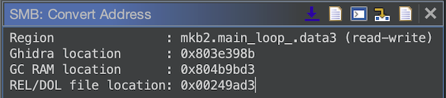

# Ghidra-SuperMonkeyBallTools

[Ghidra](https://github.com/NationalSecurityAgency/ghidra) plugin with tools for Super Monkey Ball 2 reverse engineering.

## Install

- Download the plugin .zip from the [releases page](https://github.com/ComplexPlane/Ghidra-SuperMonkeyBallTools/releases)
- Move the .zip to `<Ghidra install dir>/Extensions/Ghidra/`
- Start Ghidra, go to (`File > Install Extensions...`), and enable the extension

## Features

### Address Conversion

- Convert a Ghidra address to an address in GameCube memory
- Convert a Ghidra address to a location in a .dol/.rel file
- Convert an address in GameCube memory to a Ghidra address

**SMB Address Conversion window**: `Window > SMB: Convert Address` in CodeBrowser

**Shift-G**: Go to GameCube RAM address

### Symbol Export

- Export symbol addresses
  - [SMB2PracticeMod](https://github.com/ComplexPlane/SMB2PracticeMod) / [SMB2WorkshopMod](https://github.com/TheBombSquad/SMB2WorkshopMod) format
  - [cube_code](https://gitlab.com/CraftedCart/cube_code) format
- Export complete C/C++ headers - much better than Ghidra's built-in support

## Build from Source

- Ensure you have `JAVA_HOME` set to the path of your JDK 17 installation
- Set `GHIDRA_INSTALL_DIR` to your Ghidra install directory. This can be done in one of the following ways:
    - **Windows**: Running `set GHIDRA_INSTALL_DIR=<Absolute path to Ghidra without quotations>`
    - **macOS/Linux**: Running `export GHIDRA_INSTALL_DIR=<Absolute path to Ghidra>`
    - Using `-PGHIDRA_INSTALL_DIR=<Absolute path to Ghidra>` when running Gradle
    - Adding `GHIDRA_INSTALL_DIR` to your environment variables
- Run `.\gradlew.bat` (Windows) or `./gradlew` (macOS/Linux)
- You'll find the output .zip file inside `/dist`

## Credits

Thanks to CraftedCart for writing the initial version of this plugin.
